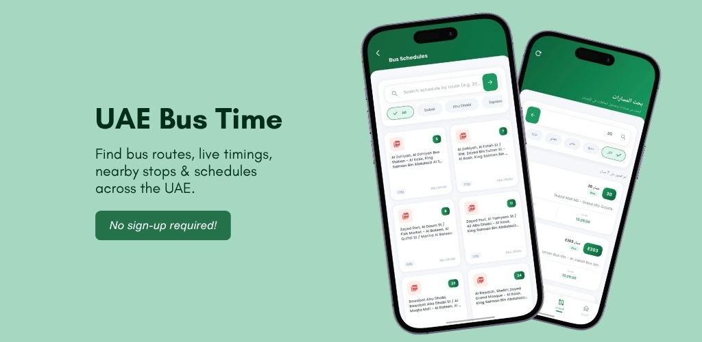

# UAE Bus Time — Web Portal & Landing Page

<div align="center">

[](https://play.google.com/store/apps/details?id=com.karinov.uae.bustiming)
[](#github-pages-deployment)
[](#)
[](#)
[](#)

<br />



<p align="center">
  <strong>Fast, lightweight, and modern web portal for the UAE Bus Time Android Application.</strong><br />
  Accurate bus schedules, departure timings, nearby stops, and official transit timetables across Dubai, Abu Dhabi, Sharjah, and all 7 Emirates.
</p>

[**Download on Google Play**](https://play.google.com/store/apps/details?id=com.karinov.uae.bustiming) • [**About Us**](./about.html) • [**Privacy Policy**](./privacy.html) • [**Terms of Service**](./terms.html) • [**Disclaimer**](./disclaimer.html)

</div>

---

## 🌟 Key Highlights

- **Complete UAE Coverage:** Access schedules for Dubai RTA (Regular, Express, Metro Feeder), Abu Dhabi ITC / Darb, Sharjah SRTA, and Intercity cross-emirate lines.
- **Interactive Live Route Explorer:** In-browser interactive search and filter by category (All, Dubai, Abu Dhabi, Express, Feeder).
- **Nearby Stops & GPS Radar:** Distance finder for bus stops within 200m to 5km radius.
- **Instant Bilingual Support:** Seamless English & Arabic station and schedule representation.
- **Official PDF Timetables:** Direct access to downloadable timetables for offline commuter resilience.
- **Zero Sign-Up Required:** 100% free with no account creation or tracking barriers.
- **GitHub Pages Ready:** Pre-configured with `.nojekyll`, SEO tags, Open Graph, `robots.txt`, `sitemap.xml`, and branded `404.html`.

---

## 📱 App Details

| Property | Value |
| :--- | :--- |
| **App Name** | UAE Bus Time |
| **Package ID** | `com.karinov.uae.bustiming` |
| **Platform** | Android 7.0+ |
| **Price** | 100% Free |
| **Developer** | Karinov / Dubai Time |
| **Play Store Link** | [Google Play Store](https://play.google.com/store/apps/details?id=com.karinov.uae.bustiming) |

---

## 📂 Repository Structure

```plaintext
├── .nojekyll              # Bypasses Jekyll on GitHub Pages
├── 404.html               # Branded fallback error page
├── about.html             # About Us page
├── app.js                 # Interactive JavaScript logic (filters, carousel, FAQ, scroll spy)
├── cover-uae.jpg          # Hero dual-device mockup banner
├── disclaimer.html        # Public transport & authority non-affiliation disclaimer
├── index.html             # Primary landing page
├── playstore.png          # Google Play download badge
├── privacy.html           # Privacy Policy page
├── README.md              # Project documentation
├── robots.txt             # Search engine crawling rules
├── sitemap.xml            # SEO sitemap
├── style.css              # Custom responsive stylesheet & transit design system
├── techico.png            # App brand logo / favicon
└── UAE Bus Timing/        # High-res app screenshot gallery
    ├── 1.jpg              # Stops & Schedules screen
    ├── 2.jpg              # Bilingual Arabic/English screen
    ├── 3.jpg              # Browse Schedules & PDF screen
    ├── 4.jpg              # Easy Journey Planning screen
    ├── 5.jpg              # Detailed Trip Insights screen
    └── 6.jpg              # Find Bus Quickly screen
```

---

## 🚀 GitHub Pages Deployment

This repository is ready to be served directly on **GitHub Pages**:

1. Push this repository to your GitHub account (e.g. `your-username/dubaitime-app`).
2. Go to your repository **Settings** → **Pages**.
3. Under **Build and deployment**:
   - **Source:** `Deploy from a branch`
   - **Branch:** `main` (or `master` / `gh-pages`) / folder: `/(root)`
4. Click **Save**.
5. Your website will be live in seconds at `https://<your-username>.github.io/dubaitime-app/`!

---

## 💻 Local Development

No build tools or heavy node dependencies required. Simply open `index.html` in your browser, or run a local static server:

```bash
# Using Python 3
python -m http.server 8000

# Using Node.js (npx serve)
npx serve .
```

Then visit `http://localhost:8000` in your web browser.

---

## 🤝 Partners & Acknowledgements

- **Spatial Exploration Partner:** [UAE Days (uaedays.vercel.app)](https://uaedays.vercel.app/) — Exploring points of interest, cultural landmarks, and spatial transit hubs across the UAE.
- **App Publisher:** [Karinov](https://play.google.com/store/apps/details?id=com.karinov.uae.bustiming) & Dubai Time digital ecosystem.

---

## ⚖️ Disclaimer

*UAE Bus Time is an independent transit application developed by Karinov. It is not officially associated with or endorsed by the Roads and Transport Authority (RTA Dubai), Integrated Transport Centre (ITC Abu Dhabi / Darb), Sharjah SRTA, or any UAE government agency. All trademarks belong to their respective statutory owners.*

---

<div align="center">
  <sub>© 2026 UAE Bus Time. Developed with ❤️ by Karinov.</sub>
</div>
